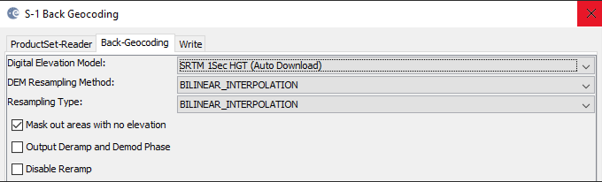
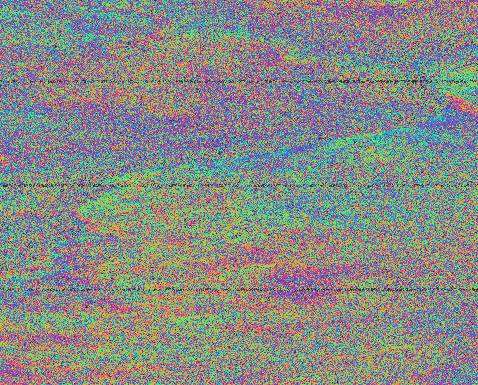
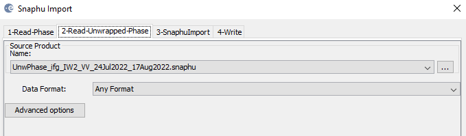

# Digital Elevation Models from Sentinel-1 SAR data via SNAP Toolbox.

Obtaining DEM's from Sentinel-1 SAR data through SNAP toolbox. This repository does not contain any python code and is rather a demonstration of the retrieval and usage of SAR data to create Digital Elevation Models. It generally covers the overarching steps, but is by no means a step by step guide. 

## 1) Find suitable data ##
Find data via Copernicus Sci Hub. I have chosen a section over the eastern mountain range in the US state of Washington.
The data I have started with is named: S1A_IW_SLC__1SDV_20220724T015425_20220724T015452_044236_05479C_68C5
  * Start Time: 07/24/22, 01:54:25Z
  * Stop Time: 07/24/22, 01:54:52Z
  * Flight Direction: ASCENDING
  * Polarization: VV+VH

___

## 2) Locate Baseline ##
Using the [ASF Data Search Vertex](https://search.asf.alaska.edu/#/) to locate the baseline. Baseline uses information from two synthetic aperture radar (SAR) images of the same target area acquired at different times (temporal baseline) and from slightly different satellite orbit positions (perpendicular baseline).
The tile I have used is: S1A_IW_SLC__1SDV_20220817T015427_20220817T015454_044586_055259_036A
  * Perpendicular: -8 meters
  * Temporal: 24 days
  * Start Time: 08/17/22, 01:54:27Z
  * Stop Time: 08/17/22, 01:54:54Z
  * Flight Direction: ASCENDING
  * Polarization: VV+VH
This tile has a perpendicular baseline of -8m and a temporal baseline of 24 days.

___

## 3) SNAP data load and S-1 Tops Split ##
Moving on to the SNAP Toolbox, where upon loading the two downloaded products in, I will select a sub-swath of the SAR data to be used by using the S-1 TOPS Split function. Subswatch IW2 is used and with bursts set from 2 to 5. For polarisation, VV have been selected. This is done for both files.

___

## 4) Apply Orbit Correction ##
Applying precision orbit correction with Apply-Orbit-File. Sentinel-1 images do not include the data in the product, which is why the orbit file needs to be added.
Orbit data are automatically downloaded by Sentinel-1 Toolbox.

  
___

## 5) DEM-assisted Back-Geocoding Coregistration ##
Using the back geocoding command we select the two images and apply the standard settings as seen below. This produces a single stack file.

   

## 6) S-1 Enhanced Spectral Diversity ##
Adding the Enhanced Spectral Diversity function. Processing parameters are left as standard.
 
___

## 7) Interferogram formation ##
The first phase image is now produced and below is a snapshot of it. This step computes the phase difference map and attempts to eliminate other sources of error such as the curvature of the reference surface. Coherence image has also been generated and is seen on the right.
Note the demarcation lines still present.

  
___

## 8) S-1 TOPS Deburst ##
Then to seamlessly join all bursts in a swath into a single image, we apply the TOPS Deburst operation.

 
___

## 9) Goldstein Phase Filtering ##
We then add the Goldstein Phase Filtering which is a technique that increases the signal-to-noise ratio. We set it with standard parameters and notice that the interferometric phase is significantly improved as seen on the right below.

 
___

## 10) Snaphu Unwrapping ##
We now perform three steps. 
1) Snaphu Export as seen below with row and column overlap set to 200 and and statistical cost mode to TOPO.

 

2) Snaphu Unwrapping - This part uses the exported image file from the step above as input and outputs a new product. This process is very time consuming.

 

3) Snaphu Import - Using the unwrapped data we import to finalize the Snaphu processing

 
___

## 11) Phase to Elevation ##
Using the phase to elevation with the below settings produce an elevation map but with bad edges. (Example on the 3rd image right side).
By using the raster -> subset, we cut out the sides of the image or rather, choose a smaller subset of the data.

 

___

## 12) Range Doppler Terrain Correction
For the interferogram to be useful, it needs to be projected onto a geographic coordinate system using a reference DEM. 

 

 

## 13) Export as KMZ file and displayed in Google Earth Pro on top of a Satellite image
DEM (Elevation VV)

DEM (Elevation)

